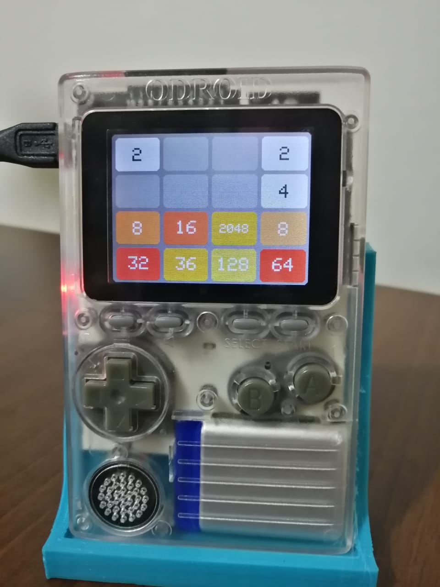
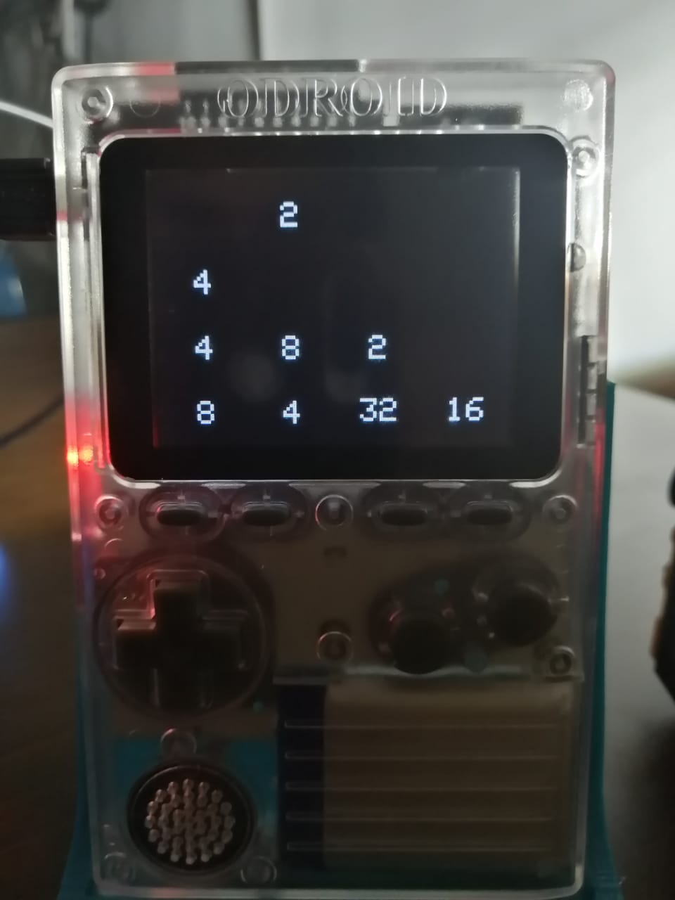

# Odroid Go 2048

|Normal|Dark mode|
|---|---|
|||

## Installation

- Download 2048.fw from releases.
- Save it to your SD card /firmwares.
- Hold B and restart your Odroid.
- You should be able to select it now.

## Control

|Action|Control|
|---|---|
|Restart|B|
|Undo|A|
|Change Brightness|Start + up or down|
|Toggle Dark mode|Start + left|

## Development

- `scripts/gen_icon.sh`: generate the app icon
- `scripts/build.sh`: build the fw and reflash the firmware.